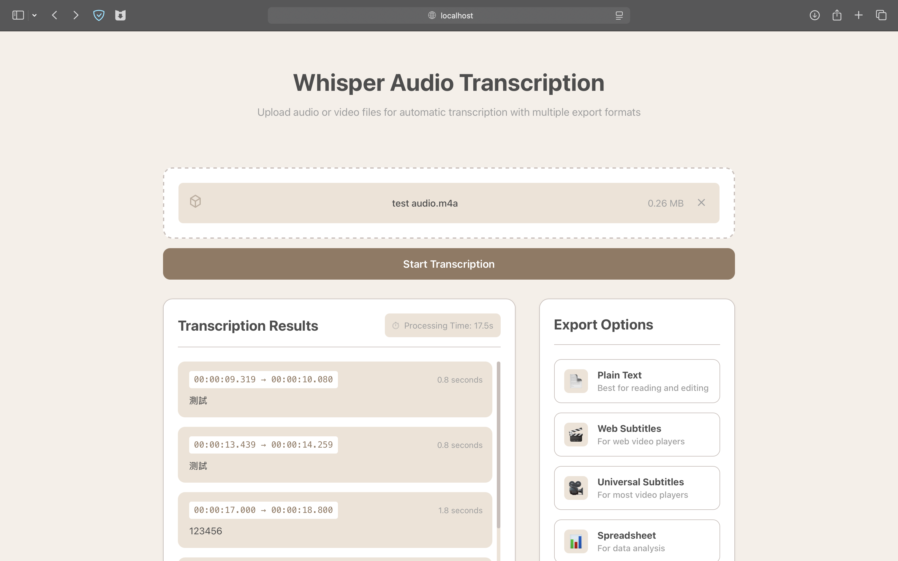

# WhisperUI

A minimalist and elegant user interface for OpenAI's Whisper speech-to-text model, built with React + Vite. This application provides an intuitive way to transcribe audio and video files with high accuracy.



## Features

- 🎯 Clean and intuitive user interface
- 📁 Drag-and-drop file upload
- 🎵 Support for multiple audio/video formats (MP3, WAV, M4A, MP4, etc.)
- ⚡ Real-time transcription with progress feedback
- 🔍 Segment-based display with timestamps
- 🔎 Advanced search functionality:
  - Real-time search with keyword highlighting
  - Navigation between search results
  - Search result count display
  - Visual indicators for matched segments
- 🎬 Integrated media player with:
  - Support for both audio and video playback
  - Click-to-play transcription segments
  - Auto-scroll synchronized with playback
  - Visual highlighting of current segment
  - Time-synced transcription tracking
- 📝 Multiple export formats:
  - Plain text (TXT)
  - WebVTT subtitles (VTT)
  - SubRip subtitles (SRT)
  - Tab-separated values (TSV)
  - Full transcription data (JSON)
- 🎨 Responsive design for all screen sizes
- 🔧 Enhanced transcription accuracy with custom Whisper parameters

## Prerequisites

- Python 3.9+
- Node.js 18+
- FFmpeg (for audio processing)

## Tech Stack

### Frontend

- React 18
- Vite (for fast development and optimized builds)
- Modern CSS with variables
- Axios for API calls

### Backend

- Flask
- OpenAI Whisper
- FFmpeg for audio processing

## Installation

1. Clone the repository:

```bash
git clone https://github.com/JT-427/whisper-ui.git
cd whisper-ui
```

2. Set up the backend:

```bash
# Create and activate virtual environment
python -m venv venv
source venv/bin/activate  # On Windows: venv\Scripts\activate

# Install dependencies
pip install -r requirements.txt

# Run the Flask server
python app.py
```

3. Set up the frontend:

```bash
cd frontend

# Install dependencies
npm install

# Start development server
npm run dev
```

4. Access the application at `http://localhost:5173`

## Environment Variables

### Backend

- `FLASK_ENV`: Set to `development` or `production`
- `PORT`: Server port (default: 5510)

### Frontend

- `VITE_API_URL`: Backend API URL (default: http://localhost:5510)

## Project Structure

```
whisper-ui/
├── app.py              # Flask backend server
├── requirements.txt    # Python dependencies
├── frontend/
│   ├── src/           # React source files
│   ├── public/        # Static files
│   └── package.json   # Node.js dependencies
└── README.md
```

## API Endpoints

- `POST /transcribe`: Upload and transcribe audio/video file
- `POST /download/<format_type>`: Download transcription in specified format

## Development

### Backend Development

The backend uses Flask and the Whisper model for transcription. Custom parameters have been configured for optimal transcription results:

- Enhanced silence detection
- Word-level timestamps
- Hallucination prevention

### Frontend Development

The frontend is built with React and powered by Vite, featuring:

- Lightning-fast HMR (Hot Module Replacement)
- Modern React hooks and patterns
- Custom styling with CSS variables
- Responsive design principles
- Real-time feedback
- Optimized production builds

## Contributing

1. Fork the repository
2. Create your feature branch (`git checkout -b feature/AmazingFeature`)
3. Commit your changes (`git commit -m 'Add some AmazingFeature'`)
4. Push to the branch (`git push origin feature/AmazingFeature`)
5. Open a Pull Request

## License

This project is licensed under the MIT License - see the [LICENSE](LICENSE) file for details.

## Acknowledgments

- [OpenAI Whisper](https://github.com/openai/whisper) for the amazing speech recognition model
- [React](https://reactjs.org/) for the frontend framework
- [Flask](https://flask.palletsprojects.com/) for the backend framework
